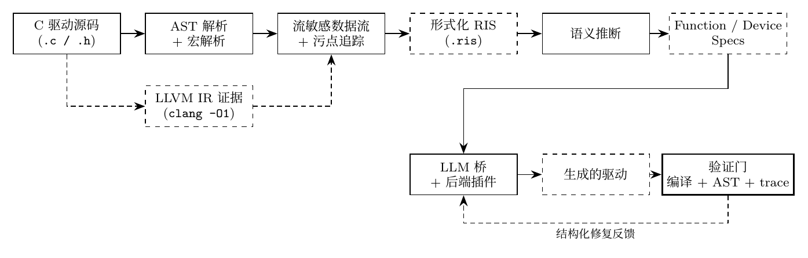
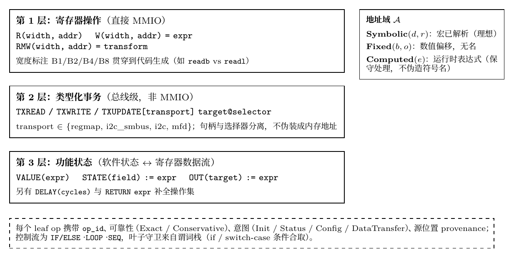
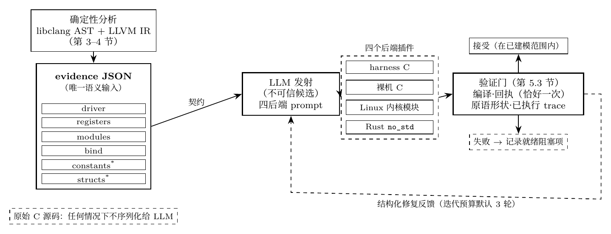
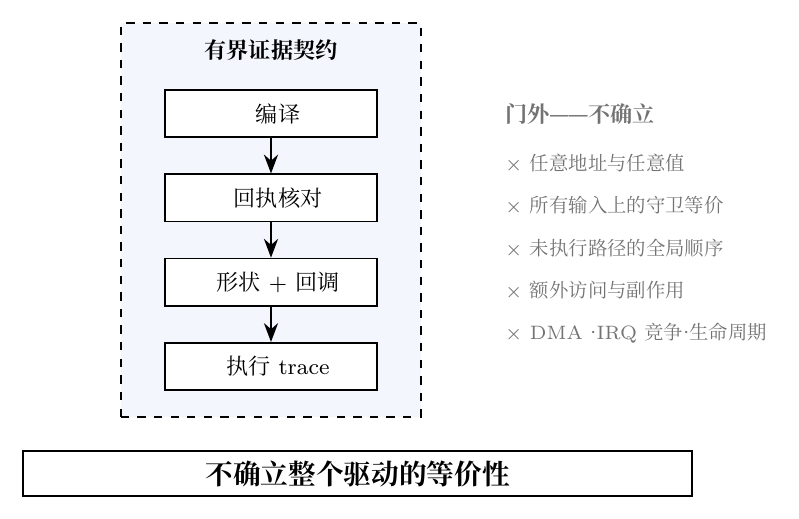
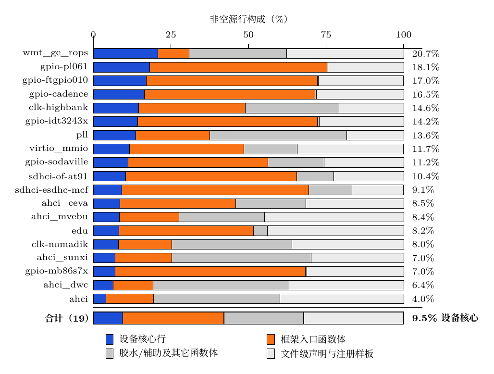
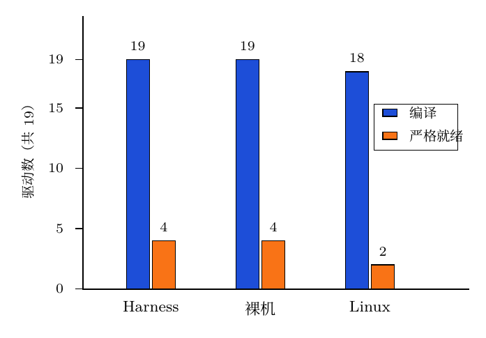
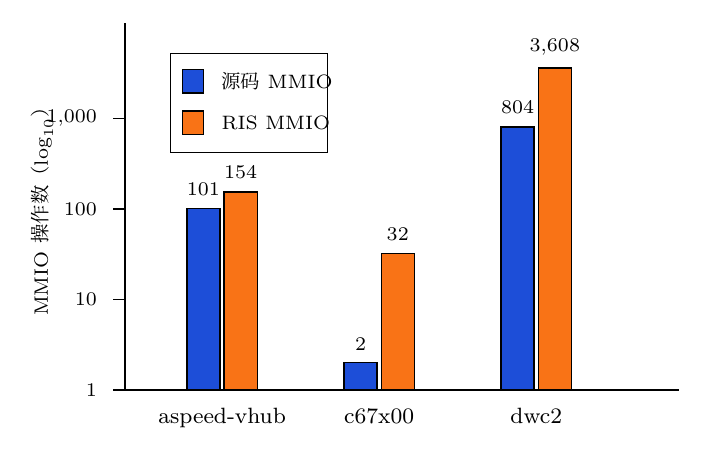
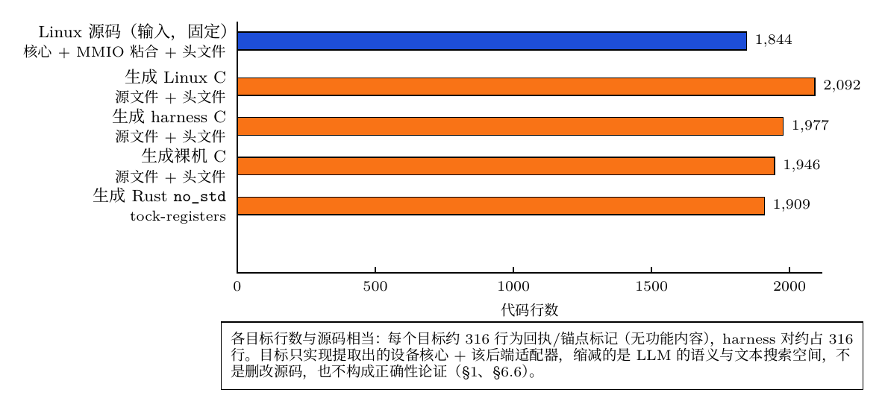

# reharness 中文译稿（供审核）

> **译稿说明**
> - 源文件：`research/paper/v2/main.tex` + `sections_1_2.tex`、`sections_3_5.tex`、`sections_6_8.tex`、`sections_9_11.tex`（v2，ASPLOS 投稿版，2026-09-04 全量重译，对齐三轮评审修复后的英文版；上一版译稿为 2026-08-31 快照，已过时）。
> - 正文中所有 `\Eval*` / `\MultiSource*` / `\Dw*` / `\Cadence*` 等宏已按 `generated_results.tex` 替换为实际数值（如 \EvalDrivers→19、\EvalOps→485、\DwLinuxLines→2,092）。
> - TikZ 图已渲染为 PNG（`figures-zh/` 目录，200 dpi）；源文件为同目录下的 standalone TikZ（`.tex`），可重新编译。配色沿用 v2 图表设计规范：蓝（#1D4ED8）= 确定性编译/源码级证据，橙（#F97316）= 严格就绪/传播后 RIS 证据，灰 = 轴、注释与限制。PNG 文件名沿用 `figures-zh/` 内文件名（如图 3 胶水图对应 `fig8-glue-ratio.png`，图 4 就绪差距图对应 `fig3-readiness-gap.png`）。
> - 图 1–5 为原论文已有的图（图 3 为胶水占比统计图）；**补充图 A/B/C 为译稿新增**（原图没有），分别覆盖 RIS 三层操作模型、LLM 证据边界、DW APB SSI 代码规模数据，内容均取自论文正文声明，未引入新测量。补充图 C 已按当前宏值（2,092/1,977/1,946/1,909）重生成。
> - 重建图片：`cd research/paper/v2/figures-zh && xelatex <图名>.tex && pdftoppm -png -r 200 -singlefile <图名>.pdf <图名>`。
> - 术语约定：RIS（寄存器交互序列）、MMIO、regmap、I2C/SMBus、MFD、LLM、QEMU、Kbuild、`no_std`、tock-registers 等保留英文；证据契约 = evidence contract；回执 = receipt；严格就绪 = strict readiness；tree-preserving join = 保树连接；check-backed = 检查背书（编译 + 回执 + AST 叶子）。
> - 翻译中发现的原文问题汇总在文末「译者审核注记」，未改动正文。
> - 本轮英文新增内容：§6.3 层消融与 CodeQL 交叉验证、§6.6 LLM 侧六项研究索引（含重复试验、直接基线、现有工具对比、突变研究）、§7.2 loop-aware 回执原型、zero-shot 留出集并入主评估、§4.2 IR 主证据与保树连接、模型/温度/端点披露。

---

# reharness：从 C 源码到多后端目标的证据驱动设备驱动重建

**关键词**：设备驱动、证据中间表示、程序分析、代码生成、LLM 辅助合成、Rust

## 摘要

将 Linux 设备驱动翻译到另一个运行环境之所以困难，是因为其源码把操作系统集成逻辑与设备核心交织在一起。C2Rust 这类基于规则的系统会完整保留源程序结构，导致结果仍然绑定在原操作系统上，寄存器协议也仍是隐式的；而不受约束的 LLM 虽能产出惯用的目标代码，却可能幻觉出错误的寄存器行为和过时的内核 API。我们提出 **reharness**，一个带有有界确定性证据边界的混合式 LLM 翻译框架。静态提取器分析完整的 Linux 驱动，并将识别出的面向硬件的行为记录到结构化的寄存器交互序列（RIS）契约中：寄存器身份、宽度、顺序、路径谓词、类型化总线事务，以及缓冲区/状态数据流。后端插件翻译这份证据——而绝不是原始 C 源码——生成 harness C、裸机 C、Linux 内核模块和 Rust `no_std` 四种目标；LLM 只负责目标语言层面的代码发射，而确定性编译、回执核对（逐操作发射标记）、原语形状检查和已执行路径的 trace 比较共同提供有界的验收与修复。在 DesignWare APB SSI 案例研究中，1,844 行 Linux 源码生成 2,092 行 Linux、1,946 行裸机和 1,909 行 Rust 目标代码。在 19 个驱动和 3 个多源模块上的评估将确定性基线编译与保守的产物就绪性区分开来。两个确定性输出在规则式基线下通过 QEMU 值级/trace oracle，其 provenance 由版本化的 manifest 摘要、源码哈希和内核镜像 SHA-256 锚定。DesignWare 产物集通过版本化、机器可检的 18 项产物清单全部 18 项；其记录的修复链部分为人监督（逐后端披露），且受约束管线的有界预算重复试验精确量化了仅靠自动预算能复现到什么程度。逐后端 provenance 与证据详见评估一节。

---

## 1 引言

设备驱动占操作系统代码的很大比例，也在内核故障中占据不成比的份额 [1, 2]。把驱动移植到用户态测试 harness、裸机固件、其他操作系统环境或内存安全语言，因此是一个反复出现的系统问题。虽然这项任务常被描述为「源到源转换」，但驱动并不是一个同质的程序。它的 C 源码交织着两类关注点：**操作系统集成**——包括资源获取、子系统注册、回调、同步和对象生命周期；以及**设备核心**——包括寄存器交互、总线事务、路径条件，以及软件状态与设备之间的数据搬运。后者包含需要保留的面向硬件行为；前者需要在目标环境中重新绑定，但仍可能通过回调和状态影响后者。

现有翻译方法对这种混合结构处理不佳。C2Rust [3] 这类确定性翻译器在结构上可复现地保留源程序，但也因此把 Linux 特有的框架代码及其指针密集的表示带进了目标程序。翻译结果仍然绑定在不一定存在于 Linux 之外的 API 和生命周期上，而设备协议仍隐含在语法之中。直接的大语言模型（LLM）翻译走的是另一个极端：模型可以重组代码并发出惯用的目标 API，但同时也被要求自行推断哪些源行为是重要的。对驱动而言，这种授权是不安全的。一个看似合理的候选可能新增一条 DMA 命令、漏掉一次中断应答、改变寄存器宽度，或重排一次缓冲区更新，而编译依然通过。

因此核心问题不在于翻译应该用规则还是 LLM，而在于**允许非确定性出现在哪里**。我们提出 **reharness**，一个把 LLM 夹在两个确定性阶段之间的受约束混合翻译管线。第一，静态分析检查完整的 Linux 驱动——包括其框架粘合代码——并将识别出的硬件相关行为记录到结构化的证据契约中。契约以寄存器交互序列（RIS）加上设备与绑定规约的形式表达，记录已识别的寄存器身份、宽度、操作顺序、路径谓词、类型化总线事务，以及选定的软件状态/数据流效果。第二，LLM 翻译这份紧凑的契约（而非原始 C 源码）为特定后端的实现。第三，确定性编译、回执核对和已执行路径 trace 比较决定候选是否在建模范围内被接受。

这种分离是语义层面的，而不是源码变换。reharness 不会从输入驱动中删除 Linux 粘合代码，也不会假设框架代码无关紧要。提取器分析完整的翻译单元，保留任何会影响硬件交互的条件、状态绑定、调用关系或资源事实。它从跨后端契约中排除的，只是那些未建立设备核心效果的框架结构。因此，LLM 无需重新发现 Linux 集成与硬件行为之间的边界，也无需凭记忆复现每一个内核惯用法。

把模型限制在提取出的契约内也缩小了翻译面。在 DesignWare APB SSI 案例研究中，固定的 Linux 源码（核心 + MMIO 粘合 + 头文件）共 1,844 行，而生成的目标包含 2,092 行 Linux C（源文件与头文件）、1,946 行裸机 C（源文件与头文件）和 1,909 行 Rust `no_std`。这些总数是**相当的**而非更小：harness 对中有 316 行是回执与锚点标记，不携带功能内容，各后端比例相近。缩小的不是原始行数而是语义面：每个目标只实现提取出的设备核心加上该后端所需的适配器，模型从不翻译源码的框架集成粘合。这是模型文本与语义搜索空间的缩减，不是删除源码，本身也不构成正确性论证；更小且结构化的输入输出可能减少发明无关框架 API 或控制流的机会，但当前验证门只拒绝在已建模契约和已检查 trace 下可观察的偏差。

reharness 的五项贡献：

- **设备核心提取管线**：结合 libclang AST 分析、流敏感数据流与污点追踪，以及 `-O1` 下的 LLVM IR 证据。从完整 Linux 驱动源码记录已识别的硬件相关证据，并恢复隐藏在头文件内联 `static inline` 访问器中的 MMIO 操作。
- **RIS 证据语言**：将寄存器操作扩展为带类型的 regmap/I2C/MFD 事务和功能状态操作（`ValueBind`、`StateWrite`、`OutputWrite`），记录选定的缓冲区到寄存器的数据流。
- **受约束的混合 LLM 翻译器**：四个后端插件——harness C、裸机 C、Linux 内核模块、Rust `no_std`——共享同一份确定性证据契约。LLM 接收契约和固定的后端 prompt，从不接收原始 C 源码。
- **有界验证门**：结合严格编译、已识别寄存器操作的 exactly-once 回执核对、已覆盖 C 叶子的原语形状检查，以及带结构化有界修复的已执行路径 trace 比较。LLM 输出被视为不可信候选而非权威翻译。
- **有产物支撑的评估**：覆盖 19 个单源驱动和 3 个多源模块，包括确定性 QEMU 实验、一个通过 18 项清单的四后端 DesignWare APB SSI 产物案例，以及量化仅靠自动预算能复现多少的受约束管线有界预算重复试验。推迟的更强实验随产物显式列出。

## 2 研究动机

### 2.1 Linux 驱动交织着两类翻译关注点

Linux 驱动的硬件协议很少以孤立代码块的形式出现。`probe` 回调获取 MMIO 资源并初始化设备寄存器；中断回调把框架状态与状态读取/应答访问混在一起；传输回调在 FIFO 读写之间推进软件缓冲区。寄存器访问器可能是宏或头文件中的 `static inline` 函数，而调用它们的回调则通过子系统特有的 operations 表注册。设备核心语义与 Linux 集成因此跨函数、跨翻译单元地交织在一起。

一个有用的跨后端表示必须分离这两类关注点，同时又不能假装框架代码没有效果。例如，回调的注册属于 Linux 粘合代码，但回调字段与函数之间的绑定决定了该函数的语义角色；资源获取是平台相关的，但它确立了哪个状态字段是 MMIO 基址；框架回调中的一个分支可能守卫着一次寄存器写，因而必须保留在提取契约中。reharness 把这些构造当作证据来分析，但只翻译得到的设备核心行为。「分析完整源码、翻译更小的语义契约」这一区分是我们混合方法的基础。

### 2.2 现有翻译边界是不够的

**确定性源码翻译。** C2Rust 式翻译 [3] 用确定性编译器变换把 C 语法和控制流映射到目标语言。这提供了可复现性和广泛的语法覆盖，但保留了源程序的分解结构。Linux 驱动的 `devm_*` 资源调用、回调表、锁惯用法、错误回退路径、侵入式容器和内核对象生命周期全部以翻译形式存活。在 Linux 之外，许多这类 API 并不存在；在 Rust 中，其指针和别名结构往往仍是 `unsafe` 的，因为翻译器无法区分 MMIO 映射、软件缓冲区和普通指针。第 6 节在一个具体设备上量化了这一对比：C2Rust 完全无法 transpile 固定的内核驱动，而其对携带相同寄存器协议的去内核化 stub 的 transpile 产物仍把协议隐含在指针算术中、无法验证。

LLVM [4] 这类编译器基础设施让大规模 C 程序的分析与变换变得日常，CodeT5 [5] 这类代码预训练模型也改进了习得的代码生成。但这两条工作线都不能从整程序语法翻译中抽出可复用的设备契约：宏定义的偏移、包装访问器、依赖寄存器的分支、事务 API 和缓冲区/FIFO 顺序仍然编码在目标语言语句中，把结果再定向到另一个后端仍需开发者手工恢复同样的硬件协议。确定性有价值，但保留每一个源码级关注点并不等于保留正确的跨平台语义。集成代码的普遍性是可测量的：在 19 个驱动语料中，非空源行仅有 **9.5%** 被已发射的设备核心操作引用；其余 **90.5%** 分解为框架入口函数体（**32.6%**）、胶水/辅助及其它函数体（**25.7%**）与文件级声明和注册样板（**32.2%**）（图 3）。

**直接 LLM 翻译。** 大语言模型走的是另一个极端：它可以重组代码并选择惯用的目标 API，但直接翻译把语义发现和代码发射同时交给模型。模型必须一次性地决定哪些回调重要、区分 MMIO 与普通内存、解析宏和包装调用、保留路径守卫，并重构目标特有的框架代码。完整的 Linux 源码还提供了大量子系统样板，容易诱使模型使用记忆中但版本不兼容的 API。近期的 LLM-for-kernel 工作因此停留在有界任务上——为内核模糊测试挖掘 syscall 规约 [18]、策划驱动更新数据集 [19]——而非整驱动生成。

这些失败不只是风格问题。开发期间，一个禁止 DMA 和 IRQ 配置的 QEMU edu prompt 仍然产出了分配 DMA 状态并写入 `DMA_CMD|DMA_IRQ` 的候选；由此引发的中断风暴挂死了 guest，也摧毁了反馈通道。其他候选使用了过时的内核接口，或在相同证据下产出不同行为。编译无法检测类型正确但多余的寄存器写、缺失的应答，或推进错误的传输缓冲区。直接 LLM 翻译因此缺少一个关于「目标必须保留什么」的稳定权威。

**确定性语义边界。** TransCoder [6] 和 CoTran [7] 这类混合翻译器把学习式翻译与反馈结合起来，但仅有验证并不能定义允许模型重新解释的范围。如果模型仍然接收完整驱动并负责提取其含义，候选搜索空间就包含任意的遗漏和发明。测试可以拒绝观察到的失败，但其本身并不提供完整的翻译契约。

更早的驱动分析与合成系统为这样的边界提供了确定性基础。SDV 检查操作系统 API 协议 [8]；Coccinelle 的语义补丁在内核规模上自动化驱动的伴随演化 [20, 21]；LDV 工具集验证内核模块的 API 规则符合性 [22]；Devil+ 和 Dingo/Termite 从显式的设备/OS 模型合成驱动 [9, 10, 11, 12]；KLEE 和 S2E 在存在可执行环境时探索路径 [13, 14]。这些方法或针对框架协议、或自动化局部编辑而非翻译、或需要手工编写的规约、或依赖可执行模型，都不能从既有 Linux 驱动中提取紧凑的硬件契约来作为受约束多后端翻译的输入。

reharness 把确定性边界移到了生成之前。AST 与 LLVM IR 分析确定硬件相关操作及其来源；流敏感分析确定顺序、谓词和数据依赖；语义推断提供设备角色和后端绑定。只有这种与框架无关的证据被送给 LLM。模型被指示选择「如何表达一个已确立的操作」，而不是「它是否存在」。生成之后，回执——生成代码必须为每个契约操作携带的发射标记——强制要求可追踪的寄存器投影，trace 比较检查已执行路径上的预期 MMIO 顺序。这遵循了更广泛的翻译验证思想 [15, 16, 17]，但将其收窄为面向生成驱动的、绑定证据的检查。

由此得到的目标包含提取出的设备核心和后端特有的适配器，而不是对每个源码构造的翻译；其原始行数与源码相当（差值来自回执与锚点标记），但模型导航的语义与文本搜索空间只有设备核心。这是模型搜索空间的缩减，不是删除源码，本身也不构成正确性论证。对已建模性质的信心来自确定性证据和声明的验收检查；有界的表面让概率性步骤更容易约束和审计。

---

## 3 系统设计与证据契约

reharness 是一个四阶段管线，把 C 驱动源码变换为经过验证门把关的后端特定驱动代码。图 1 展示了工件在系统中的流动。核心设计原则是**证据契约**：确定性分析确立所要求的已建模行为，下游阶段被指示「重新表达」而非「重新解释」。验证门检查所要求的可追踪寄存器操作和已执行 trace；它不声称排除每一个额外的硬件访问，也不确立整个驱动的等价性。

**图 1：reharness 架构**



*图注：C 驱动源码 → AST 解析 + 宏解析 → 流敏感数据流 + 污点追踪 → 形式化 RIS（.ris）→ 语义推断 → Function/Device Spec → LLM 桥 + 后端插件 → 生成的驱动 → 验证门（编译 + AST + trace）。源码同时经 `clang -O1` 生成 LLVM IR 证据补充给数据流阶段（虚线）；验证门失败时以结构化修复反馈回送 LLM 桥（红色虚线）。阶段 1 为混合 AST+IR 提取，阶段 2 推断与后端无关的规约，阶段 3–4 经可插拔后端发射目标驱动，验证门提供有界修复反馈。*

### 3.1 架构与确定性边界

确定性 AST 分析解析宏、回调绑定、控制流和数据依赖；LLVM IR 补充被头文件内联访问器隐藏的 MMIO（第 4 节）。结果是 RIS 证据 IR 加上与后端无关的函数/设备摘要。后端插件把该契约序列化给 LLM，由后者发出 harness C、裸机 C、Linux C 或 Rust `no_std`。编译、已识别寄存器操作的回执核对和已执行路径 trace 检查随后在各自声明范围内接受或拒绝候选，并提供有界修复反馈。在 19 个驱动上，该管线提取出 485 个有证据操作，涉及 157 个寄存器；多源评估覆盖 19 个翻译单元和 27,447 行代码。

### 3.2 寄存器交互序列

寄存器交互序列（RIS）是 reharness 的中心结构化证据中间表示。它为寄存器、事务和功能状态观察提供机器可解析的语法，以及类型化表达式和嵌套控制流证据。当前产物没有定义完整的指称语义，也没有证明整程序精化；RIS 只对提取器识别并记录的操作与路径定义所要求的证据。每个下游阶段消费的都是这份有界证据契约。

**语法与操作层级。** 一份 RIS 文档由驱动头、一个或多个模块（每个被分析函数一个）以及用于记账与校验的元数据块组成。每个模块是有序的操作序列。顶层语法为：

```
driver <name> v<ver> {
  module <func> {
    <op>            -- 每条源语句一个操作
    ...
  }
  ...
  accounting { source_accesses N; emitted N; ... }
  ir_analysis { source "f.c" { ir_generated true; ... } }
}
```

操作分为三个语义层级。

**第 1 层：寄存器操作**，建模直接 MMIO 交互：

- `R(<width>, <addr>)` —— 读：从寄存器地址加载给定宽度的值；结果绑定到一个变量。
- `W(<width>, <addr>) = <expr>` —— 写：存储一个计算出的表达式。
- `RMW(<width>, <addr>) = <transform>` —— 逻辑上的读-改-写：记录一次读、一个变换表达式和对同一地址的写回。它不声称硬件级原子性。

宽度标注（`B1`、`B2`、`B4`、`B8`）以字节记录访问宽度，区分字节宽的状态读、32 位配置写和 64 位访问。该信息贯穿代码生成，使后端选择正确的原语（Linux 中的 `readb` 与 `readl`，或 Rust `tock-registers` 中对应的寄存器字段宽度）。

**第 2 层：事务操作**，建模非 MMIO 的类型化总线级访问：

- 读：`TXREAD[<transport>] <target>@<selector>` 选择 transport（regmap、I2C/SMBus 或 MFD）和目标寄存器。
- `TXWRITE` 和 `TXUPDATE` —— 写和掩码更新，保留所选 transport 的语义。

transport 字段（`regmap`、`i2c_smbus`、`i2c` 或 `mfd`）区分 API 家族，target/selector 对把总线句柄与寄存器或命令选择器分开。这保留了一个扁平 MMIO 表示会抹掉的区分，例如 regmap 句柄与内存地址之别。

**第 3 层：功能状态操作**，捕获软件状态与设备寄存器之间的数据流：

- `VALUE(<expr>)` —— ValueBind：从源码级表达式（如缓冲区解引用）绑定一个变量。
- `STATE(<field>) := <expr>` —— StateWrite：更新持久驱动状态（游标、计数器、标志）。
- `OUT(<target>) := <expr>` —— OutputWrite：把值存入软件输出缓冲区。

三层操作在提取器的源序投影中按模块交错排列。`DELAY(<cycles>)` 与 `RETURN <expr>` 操作补全集合。每个操作携带 `op_id`（顺序标识符）、可靠性标签（`Exact` 或 `Conservative`）、意图标注（如 `Init`、`Status`、`Config`、`DataTransfer`）和源码位置 provenance（文件与行号）。这些标注刻画的是已识别语句，不是对原程序的完整审计。

**补充图 A：RIS 三层操作模型与地址域**（译稿新增）



*图注：第 1 层寄存器操作（直接 MMIO，宽度 B1/B2/B4/B8 贯穿到代码生成）、第 2 层类型化事务（regmap/I2C-SMBus/I2C/MFD，句柄与选择器分离）、第 3 层功能状态（VALUE/STATE/OUT，软件状态与寄存器间的数据流）；右侧为地址域 𝒜 的三个互斥类别；底部为每个 leaf op 携带的元数据与谓词栈守卫。*

**寄存器地址模型。** RIS 中的寄存器地址分为三个互斥类别，构成地址域 𝒜：

```
𝒜 = Symbolic(d, r)   —— 设备 d、寄存器 r（宏已解析）
  ∪ Fixed(b, o)       —— 基址 b、数值偏移 o
  ∪ Computed(e)       —— 运行时表达式 e
```

**Symbolic** 地址是理想结果：提取器把预处理器宏解析为寄存器名和数值偏移，产生稳定可读的标识符，如 `dws->regs.DW_SPI_DR`。**Fixed** 地址有数值偏移但没有解析出的名字——例如调用点直接写出的裸常量。**Computed** 地址携带运行时表达式，如 `base + (1 << (offset + 2))`，用于索引寄存器 bank。提取器绝不为无法静态解析的地址伪造符号名；它保留表达式并标记为 computed 访问，下游就绪分析对其保守处理。

**表达式代数。** 值使用 Const、Var、二元运算符、位切片和条件 Ite 项；Top 显式表示未解析的值。常量折叠规范化已知子表达式。RMW 提取用同一代数表示直线和分支相关的变换，在不同守卫对读值做不同变换再写回时使用嵌套 Ite 项。

**控制流。** RIS 使用 `IF/ELSE`、`LOOP` 和 `SEQ`。守卫和循环细节使用同一表达式代数。谓词栈把累积的 `if` 与 `switch-case` 条件附加到叶子操作上。这为生成和分析保留了路径证据；当前的回执与运行时检查并不独立证明生成的守卫与源守卫在所有输入上等价。

**示例。** 清单 1 展示了从 DesignWare APB SSI 发送路径提取的 RIS 片段，在单个循环体中展示了全部三个操作层级。

**清单 1**：来自 `dw_spi_transfer_handler` 的 RIS 片段——SPI 发送循环，展示功能状态操作与寄存器写交错：

```
LOOP while dws->tx_len {
  IF dws->tx {
    IF (dws->n_bytes == 0x1) {
      txw := VALUE(*(u8 *)(dws->tx))     -- ValueBind
    }
    STATE(dws->tx) := (dws->tx + dws->n_bytes) -- StateWrite：游标
  }
  W(B4, dws->regs.DW_SPI_DR) = txw           -- Write：压入 FIFO
  STATE(dws->tx_len) := (dws->tx_len + -1)    -- StateWrite：计数器
}
```

`VALUE` 操作记录 `txw` 来自发送缓冲区指针的解引用；两个 `STATE` 操作推进缓冲区游标并递减剩余长度计数器；`W` 操作把绑定的值压入数据寄存器。没有功能状态操作时，生成的驱动可以复现寄存器写模式却无法传输数据。契约因此要求 `VALUE → STATE → W → STATE` 顺序。通用运行时 oracle 只观察 MMIO 事件；专门的 DesignWare 产物检查会在生成目标中检查这一功能状态模式。

### 3.3 设备与函数语义

RIS 规定已识别的有序面向硬件证据；语义推断补充把这些证据翻译到目标环境所需的角色。每个 `FunctionSpec` 记录与后端无关的签名、回调角色、执行上下文、状态绑定、效果、前置/后置条件及其 RIS 模块的引用。回调表证据优先于名字启发式：例如 `irq_chip.irq_ack` 初始化式确立中断应答角色，即使函数名有歧义。C 类型被抽象为 `DeviceState`、`LogicalIRQ`、`UInt` 等概念。

`DeviceSpec` 将这些函数契约与设备类别、状态、资源、被访问的寄存器映射和不变式组合起来。MMIO 基址表达式变成设备状态绑定；观察到的回调角色引入相应的 IRQ、clock、GPIO、SPI 或总线资源。结果描述提取出的设备核心，而不规定 Linux C、freestanding C 或 Rust 语法。

### 3.4 后端绑定与证据 JSON

`BindSpec` 把抽象概念映射到某个后端：类型、MMIO 原语、状态表达式、回调槽位和导出入口。源码事实保留对重建有用但不属于可移植契约的支持信息，包括结构体字段、常量、回调初始化式和资源获取证据。生成时，reharness 把 RIS 操作、设备身份/类别、`BindSpec` 和选定源码事实序列化为一份证据 JSON。跨越边界的 `FunctionSpec` 角色被物化为回调和状态绑定，而不是作为独立对象序列化。该 JSON 是 LLM 的唯一语义输入；不包含原始 C 源码。

---

## 4 设备核心契约提取

提取阶段把完整 Linux 驱动源码变换为上文定义的证据契约。基于 libclang 的 AST 路径提供宏、控制结构、回调绑定和流敏感状态；LLVM IR 补充被头文件内联访问器隐藏的操作。

### 4.1 AST 数据流与过程间分析

**翻译单元与宏。** 管线为每个 `.c` 或 `.h` 输入构造带详细处理记录的 libclang 翻译单元，保留宏定义、展开和包含头文件上下文。宏表把寄存器标识符映射到整数偏移，使 `base + GPIO_INT_EN` 成为符号寄存器地址而非不透明文本。

当存在 `compile_commands.json` 数据库时，解析器使用其包含路径、定义和目标参数；否则记录诊断并使用可用的内核包含配置。

目标函数包括生命周期入口、中断处理程序和通过 Linux operations 表注册的回调。保留表类型和字段，使语义推断能区分中断应答、GPIO 方向控制等角色。

**流敏感数据流与污点追踪。** 对每个目标函数，提取器执行流敏感的过程内数据流分析。它按源码顺序遍历函数语句，维护一个把程序变量映射到抽象值的**抽象存储** Σ: Var → 𝒱。抽象值域 𝒱 专为寄存器交互分析设计：

- `BasePtr(b)` —— 已知来源于 `ioremap` 或 `__iomem` 参数的指针；MMIO 基址。
- `Offset(b, o, r)` —— `BasePtr(b)` 加常量偏移 o，可选地带已解析寄存器名 r。
- `ReadTaint(a, r)` —— 由从地址 a 的 MMIO 读载入的值；携带把它链接回源寄存器的污点标签。
- `Const(n)` —— 整数字面量或完全折叠的常量。
- `SymExpr(t)` —— 无法完全求值的符号表达式（如运行时变量或不可分析的调用）。
- `Top` —— 不透明的未知值。

分析以已知 MMIO 源播种存储。遇到 `ioremap` 或 `devm_ioremap` 调用时，返回值绑定为 BasePtr。指针类型参数（带 `__iomem` 标注或 `void *` 类型）也播种为 BasePtr 候选。遍历过程中赋值更新存储：`g = gpiochip_get_data(gc)` 记录 `g` 派生自 `gc`；随后的 `g->base` 访问经存储解析以识别 MMIO 基址字段。

地址解析是核心操作。当提取器遇到 MMIO 调用（如 `readl(g->base + GPIO_INT_STAT)`）时，它在当前存储和宏表上求值地址表达式。表达式 `g->base + GPIO_INT_STAT` 在顶层 `+` 处拆分，得到 `g->base`（经存储解析为 BasePtr）和 `GPIO_INT_STAT`（经宏表解析为 Offset，带 `reg_name = "GPIO_INT_STAT"`）。二者组合产生带已解析基址、数值偏移和符号寄存器名的 Offset。若无宏可解析，数值常量（或表达式）保留为 Fixed 或 Computed 地址。

分支条件通过**谓词栈**跟踪。遍历器进入 `if` 体时压入条件表达式；`else` 路径压入其否定。每个叶子操作继承整个栈作为其守卫。switch-case 分支对每个 case 合取选择器相等谓词。这意味着提取的 RIS 不仅保留**访问了哪个寄存器**，还保留**在什么条件下访问**——这对 trace 级验证和生成复现相同分支行为的代码至关重要。

**读-改-写检测。** RMW 模式是关键的寄存器惯用法：从寄存器读值、修改（通常是与掩码按位 OR、AND 或 XOR）并写回同一地址。reharness 通过匹配污点流检测这些模式。当 `readl` 在地址 a 把结果存入变量 v 时，提取器在 v 上记录链接到 a 的 ReadTaint。随后对 v 的变换（`v |= BIT(n)`、`v &= ~mask` 等）被累积。当 v（或从 v 派生的表达式）的 `writel` 指向同一地址 a 时，读-变-写序列折叠为单个 `RMW` 操作。

变换表达式通过重放变换序列重构。直线代码下这是简单复合：每个复合赋值扩展表达式树。对分支相关的变换，提取器构造 ITE 嵌套：对 v 在守卫 gᵢ 下被函数 fᵢ 变换的每种情形，变换成为 Ite(gᵢ, fᵢ(v_old), …)。switch-case 变换类似处理，生成选择器相等守卫的析取。该重构记录的是提取器所表示的 RMW 变换，无需动态执行。当前验证门只在声明范围内检查其回执与原语形状义务；不独立重证任意生成值变换。

**包装内联与过程间分析。** 真实驱动把 MMIO 原语包在辅助函数里。没有过程间分析，包装内部的每个操作都不可见。reharness 从解析的 AST 构建调用图，并对被调函数做深度受限、递归安全的内联。

调用图为每个函数记录其被调者及实参到形参的绑定和调用点的控制流上下文（谓词栈）。当被调者本身是含寄存器操作的目标函数时，其提取的 RIS 操作以实参替换形参实例化，并在调用点位置合并进调用者的操作序列。对已识别的内联调用，这保留了提取器的源序投影：若 `probe` 在第 42 行调用 `gpio_setbit`、第 43 行调用 `readl`，则 `gpio_setbit` 的内联操作在最终 RIS 中出现在第 43 行读之前。

内联深度有界（默认 3）以防止深层递归调用链的无界展开，visited 集合防止循环。内联器还处理**包装摘要**：当被调者是顶层恰好含一个 MMIO 调用（读或写、无外围控制流）的简单函数时，reharness 推断一个紧凑摘要——从包装形参到底层 MMIO 操作的映射——并在每个调用点替换，无需完整重提取。这对 `dw_readl`/`dw_writel` 这类访问器对尤其有效：包装是转发到 `readl`/`writel` 的单行函数。摘要推断是保守的：它要求显式 MMIO provenance（`__iomem` 参数或惯用基址字段名）并拒绝泛型 `void *` 地址，从而降低对所覆盖包装模式的误分类。

对跨多个翻译单元的多源驱动，调用图通过符号链接解析扩展跨 TU 边。多源 manifest 经全程序分析链接 bitcode，在评估语料中解析 223 条跨翻译单元调用边。

### 4.2 IR 主证据与保树连接

AST 路径处理宏偏移、包装、条件和算术地址，但以源文件为导向的 libclang 路径仍有两个系统性盲点：内核头文件中定义的 `static inline` MMIO 访问器，以及**地址真相**。AST 对 `readl(mmio + IO_ID)` 这类访问的建模依赖模式匹配的包装摘要；它产生的地址分类（符号 vs 固定）是推断，不是关于编译产物的事实。

reharness 因此颠倒了经典的分工：**编译产物是寄存器访问真相的首要来源，AST 在其上提供意图层**。每个翻译单元以驱动真实的 Kbuild 标志编译（`clang -O1 -emit-llvm -g`）；当基线驱动与树内源码字节一致时，借用其 Kbuild `.cmd` 上下文，使被分析的 IR 就是实际构建出的产物。在 `-O1` 下，头文件访问器被内联，MMIO 原语以 inline-assembly 模板浮现：

```
; 写: movl $0, $1
tail call void asm sideeffect "movl $0,$1", "r,*m,~{...}"(...)
; 读:  movl $1, $0
%r = tail call i32 asm sideeffect "movl $1,$0", "=r,*m,~{...}"(...)
```

**物理真相提取。** 每个模板匹配产生一个操作，携带经 GEP 校验的字节偏移（地址链沿 `getelementptr` 指令回溯；循环展开与剥离按 函数/行/偏移 键去重）、宽度（取自访问器家族：`readb` 给 B1，`readq` 给 B8）和 provenance：`!dbg` 链经 `inlinedAt` 链接解析到驱动源码行，寄存器偏移经 `clang -dM` 反向索引（过滤到驱动自身源码定义的宏）映射回驱动局部的宏名。

**变量名恢复。** `llvm.dbg.value` 内建函数经其 `!DILocalVariable` 操作数把 SSA 值绑定到源码变量。内联之后，一个 SSA 临时值可能携带**多个**源码变量，因此名字选择是作用域感知的：子程序作用域与语句所属帧匹配的绑定（最内层驱动文件帧优先）胜出；真正歧义的临时值保留合成名而非伪造 provenance。

**保树连接（tree-preserving join）。** AST 形式化是一棵树（Cond/Seq/Loop 包裹携带值、变换和守卫的 Read/Write/RMW 叶子）。连接遍历这棵树并**就地升级**匹配的叶子：符号地址变成来自 IR 事实的 `Fixed{offset, name}`；守卫、值和 RMW 变换被保留；AST 建模为一个读-改-写的读/写对，对照 IR 物理对合并。未匹配的 IR 操作（AST 漏掉的物理访问）以纯 IR 操作追加；未匹配的 AST 操作（编译器消除的代码或库回调）标记为 `supplementary`。连接只会把地址**升级**为 GEP 校验的常量；绝不把 AST 已解析的地址降级为 IR 的泛型运行时偏移编码。

IR 证据对地址、偏移、宽度和物理完备性是首要的；AST 提供宏名、谓词、回调绑定、功能状态操作和值。第 6 节量化了这一分工：消融显示命名固定地址只来自 IR 层，而召回只靠 AST 补充保持（单 TU 的 IR 漏掉库中介的访问），第三方 CodeQL 查询在 209 个行定位站点中的 206 个上与合并提取一致，三个分歧被相互确认为配置门控的死代码。

### 4.3 功能状态与类型化事务提取

**功能状态。** 在寄存器与事务操作之外，reharness 还提取表示数据如何在软件缓冲区与设备寄存器之间移动的**功能状态**操作。它们把契约扩展到寄存器身份与顺序之外，但本身不确立功能等价。

提取器在数据流遍历中识别三类功能状态操作。

**ValueBind（`VALUE`）。** 当局部变量从喂给后续寄存器写参数的源码级表达式赋值时，记录该绑定。例如 `txw = *(u8 *)(dws->tx)` 产生 `txw := VALUE(*(u8 *)(dws->tx))`。提取器只保留被后续操作（寄存器写、状态更新或输出存储）消费的绑定；纯控制流临时变量保留为内部数据流事实，不发射到 RIS 模块。

**StateWrite（`STATE`）。** 当持久的驱动状态字段——经 `->` 或 `.` 访问的结构体成员——被更新时，记录该变换。包括指针推进（`dws->tx += n_bytes`）、计数器递减（`dws->tx_len--`）、标志赋值（`dws->dma_mapped = 0`）和回调注册（`ctlr->set_cs = dw_spi_set_cs`）。不逃逸出函数的局部标量临时变量不发射。这一区分很重要：状态写影响后续回调或内联辅助可见的计算，而局部赋值只是控制流簿记。对持久成员的一元递增/递减（`++`/`--`）同样捕获，重构为加法赋值。

**OutputWrite（`OUT`）。** 当值经指针解引用存储到分析识别为软件输出缓冲区的位置时，记录该存储。例如 `*(u8 *)(dws->rx) = rxw` 产生 `OUT(*(u8 *)(dws->rx)) := rxw`。提取器使用赋值的 extent 结束偏移来排序，确保右侧调用（如 `*rx = readl(base)`）先于输出写发射。

三类操作按源序提取并在最终 RIS 模块中与寄存器操作交错。顺序至关重要：SPI 发送循环的序列——`VALUE`（从 tx 缓冲区读）→ `STATE`（推进游标）→ `W`（写数据寄存器）→ `STATE`（递减计数器）——必须保留，因为重排可能写入陈旧数据或导致无法终止。证据 JSON 为生成保留该顺序；当前通用 trace oracle 检查 MMIO 投影，而案例特有的产物检查覆盖关联的缓冲区/状态操作。

**类型化事务。** 许多驱动经总线 API 而非直接 MMIO 与硬件交互。regmap 提供寄存器访问抽象层；I2C/SMBus 提供字节、字和块传输；MFD（多功能设备）辅助函数暴露每子设备的寄存器访问器。这些调用与 MMIO 语义不同：regmap 读经过总线事务而非内存加载，把 regmap 句柄混同为内存地址会产生不可靠规约。

reharness 识别公共 regmap 与 I2C/SMBus 的读、写、更新和批量辅助函数，把句柄保留为 target、寄存器/命令保留为 selector。MFD 识别以 provenance 把关，限定在 `include/linux/mfd/` 下的声明和窄寄存器辅助模式，防止任意调用被误分类为设备事务。

事务操作保留了扁平 MMIO 表示会丢失的总线级语义：带掩码和值的 `TXUPDATE[regmap]` 不等价于内存地址上的读-改-写，因为 regmap 子系统可能应用缓存、缓冲或总线特定的组帧。将这些保持为不同的类型化操作，确保生成的后端对每次访问使用正确的 API 家族。

---

## 5 受约束的 LLM 翻译与验证

提取与语义推断阶段产出 RIS、函数与设备语义、后端绑定和选定源码事实。本节定义跨越 LLM 边界的子集，然后描述后端插件、验收检查和有界修复。

### 5.1 证据边界

**补充图 B：LLM 证据边界与验收回路**（译稿新增）



*图注：确定性分析（AST + LLVM IR）产出 evidence JSON —— LLM 的唯一语义输入。六个节：driver（身份/类别）、registers（名/偏移/宽）、modules（有序操作 + 控制流）、bind（类型/原语/回调），constants*/structs*（可选，来自选定源码事实）；FunctionSpec 角色物化为回调/状态绑定而非独立对象。原始 C 源码任何情况下都不序列化给 LLM。LLM 发射的不可信候选经四个后端插件（harness C、裸机 C、Linux 内核模块、Rust `no_std`）进入验证门（编译、恰好一次回执、原语形状、已执行 trace），通过则在已建模范围内接受；失败则以结构化反馈回送修复（迭代预算默认 3 轮）或记录就绪阻塞项。*

所有后端共用一个桥，序列化六个 JSON 节：**driver**（身份与类别）、**registers**（名称、偏移、宽度）、**modules**（有序操作与嵌套控制流）、**bind**（类型、原语、状态表达式、回调和 include），以及可选的来自选定源码事实的 **constants** 和 **structs**。模块条目保留 `op_id`、地址、值/变换、事务 transport 和功能状态操作。函数角色以回调和状态绑定表示；完整的 `FunctionSpec` 对象不被序列化。

LLM 永远看不到原始 C 源码。该 JSON 是面向生成的投影，并非每个分析事实都跨越边界。prompt 授权用目标语言表达所要求的证据，但禁止发明或遗漏设备操作。后续检查检测缺失或被篡改的可追踪寄存器操作，并比较已执行的 MMIO 顺序；它们不证明不存在任意额外访问。

### 5.2 后端插件与受 prompt 驱动的翻译

每个后端是一个自包含目录，含构造其 `BindSpec` 的 Python 模块和带目标规则的 `prompt.md`。注册表发现暴露 `NAME` 和 `generate()` 的模块，因此新增目标无需修改提取或验证。**Harness C** 使用假 MMIO 和访问日志；**裸机 C** 使用 volatile 原语；**Linux C** 发出 platform 或 PCI 生命周期与内核 MMIO；**Rust `no_std`** 使用 tock-registers，把 `unsafe` 限制在基址构造。

桥用证据 JSON 实例化所选 prompt，调用配置的端点，并抽取候选代码。例如 Linux prompt 选择 PCI 或 platform 资源 API 并要求 MMIO 插桩，Rust prompt 要求对应的 tock-registers 布局和位域宏。这些规则约束目标适配，但不取代证据作为设备操作的来源。

桥基于 LangChain 客户端实现，可对接任何 OpenAI 兼容的 chat 端点；模型标识、端点和采样参数属于项目配置，不由框架固定。桥接口本身接受任何「收 prompt、返文本」的端点。更换模型不改变声明的验收标准：不同候选面对同样的编译、回执和 trace 检查。

### 5.3 编译、回执与 trace oracle

LLM 生成的代码不可信任。模型可能幻觉 API、遗漏或重排所要求的操作，或引入契约中不存在的访问。reharness 因此把每个候选视为不可信并对照 RIS 检查。通过意味着满足下述检查；不意味着每个未建模效果都被排除。图 2 概括了该边界及其明确的非声明。

**图 2：验证门的范围**



*图注：浅蓝区域即「有界证据契约」——产物实现的四级检查（① 编译、② 回执核对（恰好一次）、③ AST 原语形状 + 回调 attestation、④ 已执行路径 trace）；区域右侧的灰色 × 清单是本门不确立的性质（任意地址与值、所有输入上的守卫等价、未执行路径的全局顺序、额外访问与副作用、DMA/IRQ 竞争与生命周期行为）。界内浅色与界外灰色的对比即声明范围本身；底部横幅：不确立整个驱动的等价性。这是有界证据检查，不是完整验证。*

**编译。** 第一阶段对目标后端以严格警告编译候选。Harness 输出用 `cc -Wall -Werror` 编译；裸机输出用 `cc -ffreestanding -Wall -Werror`；Linux 输出经固定内核的 Kbuild 接口（`make M=...`）；Rust 输出用 `rustc`。编译捕获类型不匹配、未定义符号、缺失 include 和语法错误——最常见的 LLM 失败模式。编译失败的候选在更昂贵的检查运行前即被拒绝。

**AST lowering 回执。** 第二阶段是结构性核对检查。每个已识别操作获得唯一 `op_id`；生成的 C 携带含该标识符、规范化契约摘要和已发射种类的 lowering 标记。lowering oracle 检查标记存在性、基数、未知标识符、状态、种类及与冻结 RIS 契约的摘要一致性。单独的 libclang pass 检查 C 标签和已覆盖叶子操作的原语形状（种类、宽度、字节序和写语义）。当前 AST oracle 不会从生成代码独立恢复任意地址或值表达式、守卫语义或跨操作顺序；这些在证明范围之外，不得描述为从候选 AST 重算摘要。

回执对账强制四个性质：

- **存在性**：每个有可追踪地址的 RIS 操作必须有对应回执。缺失操作说明 LLM 丢弃了证据。
- **恰好一次**：每个 `op_id` 至多出现在一个回执中。重复回执说明存在冗余或重复操作。
- **种类匹配**：RIS 的 `Read` 必须 lower 为读原语调用，`Write` 为写原语调用，`ReadModifyWrite` 为同地址先读后写、或单个其值派生自该地址先前读的写（经 lowering recipe 验证）。
- **摘要一致性**：生成标记中的摘要必须与冻结契约中的规范化摘要一致。这能捕获标记级漂移，但本身不独立证明候选的地址、值表达式、守卫或控制流结构与源一致。

地址不可追踪的操作（如含不可 lower 项的 `Computed` 地址）被排除在回执对账之外，转而记录为明确的就绪阻塞项，保证检查的可靠性：它不会把无法静态解析到寄存器偏移的操作记为通过。

**Trace oracle。** 第三阶段把生成代码的运行时寄存器访问 trace 与从结构化 RIS 证据导出的 oracle 比较。trace oracle 在两个层级工作。对 harness 后端，生成的程序被执行，其 `[trace]` 日志被解析为（操作种类, 偏移）对的有序序列。oracle 从 RIS 模块的操作导出预期序列，经寄存器映射把符号寄存器名解析为偏移，并把 RMW 展开为先读后写对。

对部署在 QEMU 中的 Linux 与裸机后端，trace oracle 消费插桩的内核串口日志。插桩宏（由 Linux prompt 模板注入）在每个模块函数前发出 `[rhfn] function` 边界，每次 MMIO 访问发出 `[rh] R/W 0xO 0xV`。oracle 把这些解析为按函数分段，并用子序列匹配将每段与预期 RIS 操作序列比对——允许运行时 trace 含额外访问（如框架级读）而不判失败，只要所有预期操作按序出现。

trace oracle 还处理分支敏感性。RIS 记录带 then/else 分支的条件操作，但运行时 trace 只反映实际走过的路径。oracle 计算分支敏感的序列变体，并接受匹配其中之一的 trace。由于当前运行时日志不携带源谓词取值的证明，该检查确认的是「已执行的序列变体」，而非所有输入上的守卫等价。

**验收范围。** QEMU 匹配器使用子序列，因为框架代码可能执行提取回调契约之外的访问。它因此确认预期 MMIO 事件在已执行路径上按序发生，但不拒绝每个额外访问，也不证明不存在未建模的 DMA/IRQ/MMIO 副作用。通用运行时 trace 同样不观察 `VALUE`、`STATE` 或 `OUT`；这些操作保留在证据中，仅由 DesignWare 案例研究中的专门产物测试检查。这些限制是所报告就绪边界的一部分。

### 5.4 有界修复

任一验证阶段失败时，reharness 格式化结构化反馈并重新 prompt LLM。反馈指明具体失败：`op_id n` 缺回执、种类不匹配（预期 `Write` 实为 `Read`）、第 L 行编译错误、或 trace 不匹配（偏移 0xO 处缺操作）。LLM 收到当前候选与失败报告，并被指示产出修补后的候选。修复循环迭代直到候选通过所有检查或耗尽迭代预算（默认 3 次），届时失败被记录为就绪阻塞项。

---

## 6 评估

### 6.1 实验设置与研究问题

我们在 19 个版本化 Linux 驱动源码上评估 reharness，覆盖 GPIO 控制器、clock/PLL、AHCI SATA、SDHCI MMC、virtio-MMIO、framebuffer 光栅引擎和 QEMU edu PCI 设备。所有结果由机器可读的 `./run.sh` 管线产出并导出到 `generated_results.tex`；本节表格由其中定义的宏和表宏填充，而非手工转录。

评估回答五个研究问题：

- **RQ1（地址解析）**：在已发射的可寻址操作中，符号、固定和计算地址各占多少？
- **RQ2（层贡献与外部效度）**：每个提取层独特贡献了哪些性质？独立第三方工具（CodeQL）是否与合并结果一致？
- **RQ3（提取结构）**：提取器报告多少 RMW 模式和分支条件？
- **RQ4（基线翻译）**：确定性生成的 harness、裸机和 Linux 输出能否编译？
- **RQ5（严格就绪）**：在编译之外，生成输出是否满足声明的验证标准（AST 回执、lowering 对账和注册 attestation）？
- **RQ6（端到端验证）**：生成的驱动是否满足运行时 oracle；LLM 案例研究是否满足所报告的案例特有产物检查？

### 6.2 契约提取特征（RQ1 与 RQ3）

表 1 展示代表性子集的逐驱动提取指标。在全部 19 个驱动上，reharness 提取 485 个操作：366 个符号地址（占全部可寻址操作的 77.7%）、64 个固定地址、41 个计算地址访问。管线检测到 73 个读-改-写模式和 123 个分支条件，引用 157 个不同寄存器。

**表 1**：代表性驱动的提取结果。Sym = 符号地址，Fixed = 固定偏移，Comp = 计算地址，NAddr = 非地址操作（如 `DELAY`、`RETURN`），RMW = 读-改-写，Cond = 分支条件，Regs = 不同寄存器。每行 Sym+Fixed+Comp+NAddr = Ops；%Sym 以可寻址的 Sym+Fixed+Comp 为分母。子集覆盖经 QEMU 验证的驱动（ftgpio010、edu）、条件最重的驱动（virtio_mmio）和符号率两端的极值；全部 19 个驱动的逐驱动行在版本化 matrix 产物中。

| 驱动 | Ops | Sym | Fixed | Comp | NAddr | RMW | Cond | Regs | %Sym |
|---|---:|---:|---:|---:|---:|---:|---:|---:|---:|
| gpio-ftgpio010 | 35 | 35 | 0 | 0 | 0 | 7 | 8 | 13 | 100.0% |
| virtio_mmio | 59 | 46 | 12 | 1 | 0 | 0 | 44 | 31 | 78.0% |
| gpio-pl061 | 31 | 27 | 0 | 4 | 0 | 7 | 1 | 7 | 87.1% |
| gpio-cadence | 32 | 32 | 0 | 0 | 0 | 4 | 8 | 12 | 100.0% |
| edu | 5 | 3 | 2 | 0 | 0 | 0 | 2 | 3 | 60.0% |
| **合计（19 驱动）** | **485** | **366** | **64** | **41** | **14** | **73** | **123** | **157** | **77.7%** |

77.7% 的符号率表明预处理记录与流敏感数据流为大多数已发射可寻址操作恢复了名称。其余已发射访问被分类为 64 个直接数值偏移或 41 个针对索引寄存器 bank 的运行时表达式。汇总共有 471 个可寻址和 14 个非地址已发射操作。未知计数为零（0）是内部 provenance 计数，不是相对人工标注真值的精确率/召回率：发射前被漏掉的访问不会出现在其中。

gpio-ftgpio010 和 gpio-cadence 达到 100% 符号率，因为其所有寄存器偏移都由宏表可解析的预处理器宏定义。edu 驱动符号率最低（60%），因为其五个访问中有两个在原始源码中使用固定数值偏移。virtio_mmio 的提取最复杂：59 个操作、44 个条件，反映 virtio 配置空间访问器——其宽度与偏移在运行时选择，因而抵抗静态名字解析。

### 6.3 层消融与第三方交叉验证（RQ2）

IR 主架构（§4.2）分离两个关注点：编译产物提供地址真相，AST 提供意图。对单源语料（N=12 个可编译驱动）的消融让提取器以三种配置运行并测量移除每层的效果（表 2）。

**表 2**：12 个单源驱动上的层消融（IR-only 在固定 x86 上下文可编译的 11 个驱动上运行；gpio-pl061 需要 ARM 头文件，在所有配置中回退）。Recall = 行定位源码 MMIO 站点覆盖率；Named-fixed/op = 每驱动宏命名常量偏移数；Quality = 合成门消费的就绪分。

| 配置 | Recall | Named-fixed/op | Quality | 时间 |
|---|---:|---:|---:|---:|
| 仅 AST | 0.982 | 0.0 / 27.0 | 0.878 | 7.7 s |
| 仅 IR | 0.450 | 4.3 / 12.3 | 0.795 | 0.3 s |
| 混合（默认） | **0.982** | 3.9 / 30.9 | **0.894** | 8.0 s |

三点观察。第一，**命名固定地址只来自 IR 层**：AST 在此配置下从不发射宏命名常量偏移（每驱动 0.0），而两个含 IR 的配置都会。第二，**召回只靠 AST 补充保持**：单 TU 的 IR 单独只达 0.450，因为库中介的访问（GPIO generic 回调、SDHCI 访问器）从不出现在驱动自己的翻译单元中。第三，混合配置在保持仅-AST 召回的同时改进质量（命名地址喂给解析分量），并在 8.0 秒内完成——缓存的 AST pass 加 0.3 秒 IR 分析。

**交叉验证。** 一个独立的 CodeQL 查询——构建在与 Kbuild 相同上下文的数据库上——匹配访问器家族中的函数调用，在 11 个可建库驱动的 **209 个行定位站点中的 206 个**上与合并提取一致。三个分歧是 ahci 驱动中两工具都漏掉的同样三行：一个由 `#ifdef CONFIG_ARM64` 门控的 ThunderX errata 处理器，被固定的 x86 配置编译排除。两工具的独立一致把这三处从未解释的漏检转化为相互确证的死代码；把头文件内联访问器定义从 CodeQL 结果过滤后，剩余分歧空间为空。

同一语料还量化了 §2 的两类交织关注点：按 provenance 把每个驱动的非空行分类，合计构成为 **9.5%** 设备核心行、**32.6%** 框架入口函数体（回调与生命周期函数内的非核心行）、**25.7%** 胶水/辅助及其它函数体、**32.2%** 文件级声明与注册样板（图 3）。只有第一类跨越跨后端契约；其余三类按后端重新绑定。语料由集成代码主导，这正是语义边界设计所针对的构成。

**图 3：非空源行构成（四分类）**



*图注：逐驱动与合计的非空源行构成，按已发射操作的源行 provenance 测量。设备核心行 = 被 ≥1 个已记录操作引用；框架入口函数体 = 回调与生命周期函数内的非核心行；胶水/辅助 = 其余函数体；文件级 = 函数定义之外的声明、宏与注册表（空行不计）。合计为 9.5% 设备核心 vs 90.5% 集成。行级归属是近似：一行同时含守卫与寄存器访问时计入设备核心。*

### 6.4 翻译与严格就绪（RQ4 与 RQ5）

表 3 报告代表性子集的就绪指标（选择标准同表 1）。本小节的计数由确定性基线的规则式发射器产出；这些发射器已从树中退役、让位于 LLM-only 发射，因此这些数字描述版本化 matrix 产物中记录的冻结基线，而非当前默认路径。在该基线下，harness 后端在 19/19 个驱动上编译通过，裸机后端 19/19，Linux 后端 18/19。三个后端均编译通过 gpio-ftgpio010、gpio-pl061、gpio-cadence、virtio_mmio 和 edu。唯一的 Linux 编译失败是 sdhci-esdhc-mcf，其 SDHCI 访问器契约缺少通过的源契约 oracle。

**表 3**：就绪结果。RIS = 内部 RIS 质量启发式（0–1），FuncSpec = 函数规约质量，DevSpec = 设备规约质量。H/B/L = harness/裸机/Linux 编译。Linux ready 表示严格产物就绪；synthesis-eligible 表示具备尝试 LLM 合成的充分上下文。「–」表示该检查对该驱动/后端不适用（如无内核侧生命周期模型时的严格 Linux 就绪）；「×」表示检查适用且失败；没有「–」条目掩盖失败的检查。

| 驱动 | RIS | FuncSpec | DevSpec | H/B/L 编译 | Linux ready | Synth.-eligible |
|---|---:|---:|---:|:---:|:---:|:---:|
| gpio-ftgpio010 | 1.000 | 1.000 | 1.000 | ✓/✓/✓ | ✓ | ✓ |
| virtio_mmio | 0.897 | 0.875 | 1.000 | ✓/✓/✓ | × | × |
| gpio-pl061 | 0.924 | 1.000 | 0.938 | ✓/✓/✓ | × | ✓ |
| gpio-cadence | 1.000 | 1.000 | 1.000 | ✓/✓/✓ | × | ✓ |
| edu | 0.920 | 1.000 | 0.688 | ✓/✓/✓ | × | ✓ |

全部驱动的平均 RIS 质量分为 0.902。这是内部完整性/就绪启发式，不是校准概率，也不是相对源码级真值的精度估计。达到 1.000 的驱动（gpio-ftgpio010、gpio-cadence）拥有全符号地址、无不支持控制流转移，且回调绑定通过可用的内部 attestation 检查。

**严格产物就绪。** 编译是必要但非充分的。reharness 区分**编译**与**严格产物就绪**：后者要求在已识别契约范围内，每个可追踪寄存器操作携带强制恰好一次的 lowering 回执、AST 回执对账无缺失或重复操作、回调条目有已验证的表绑定，且无剩余就绪阻塞项（不支持的控制流转移、不安全动态地址、未证明循环摘要）。

在严格产物就绪下，harness 与裸机后端分别达到 4/19 和 4/19，Linux 后端达到 2/19。通过的驱动在版本化 matrix 产物中点名：harness 与裸机为 edu、gpio-ftgpio010、gpio-idt3243x、gpio-pl061，Linux 为 gpio-ftgpio010、gpio-idt3243x。编译（18–19/19）与严格就绪（2–4/19）之间的差距是有意的：reharness 把未知变换、不安全动态地址和未绑定子系统状态当作阻塞项而非静默近似。一个可编译但有未证明循环摘要或注册 attestation 失败的驱动被报告为「未就绪」而不是「带警告的就绪」，确保下游消费者不会把编译误当语义正确。图 4 显式呈现这一编译/就绪分离。

**图 4：编译 vs 严格产物就绪**



*图注：分组柱状图。Harness：编译 19、严格就绪 4；裸机：编译 19、严格就绪 4；Linux：编译 18、严格就绪 2。蓝柱为可编译确定性输出数，橙柱为通过已建模严格门的产物数。编译必要但不充分，且两个结果都不确立整个驱动的等价性。*

5/19 的 synthesis-eligible 指标统计其结构化上下文足以尝试辅助 LLM 合成的驱动：其证据 JSON 通过绑定、不支持操作和尝试候选所需源码事实的资格检查。该标签不意味着已生成或接受了候选。

按阻塞项清单（`research/experiments/results/matrix.json`）中记录的根因对 19 驱动语料的 15 个非严格就绪驱动分类：11 个涉及缺失或不完整的子系统/生命周期模型（3 个 exclusively——`ahci_ceva`、`ahci_mvebu`、`pll`），属人力受限类；其余失败于分析限制——需验证的保守循环摘要（9 个驱动，与子系统类重叠）、一个有 13 个计算动态寄存器地址的驱动（`gpio-mb86s7x`）、一个有不支持控制流转移、一个在合成生命周期 stub 下 AST 原语证明失败。

**Zero-shot 留出集。** 一个 12 驱动的冻结留出集——排除于所有实现工作之外、由树内反特化 guard 强制——经同一确定性管线运行：12/12 在三个后端上编译，严格就绪 harness/裸机为 7/12、Linux 为 5/12，5/12 在所有后端上严格。留出集的严格就绪率高于开发语料（4/19）；§7.3 表明这是语料构成效应——开发集的八个 AHCI 与 clock 驱动全部被阻塞，而留出集没有采样到它们——而非泄漏信号。留出 matrix 及其版本化结果随产物报告（`research/experiments/results/zero-shot-v2-matrix.json`）。

### 6.5 多源可扩展性

为评估管线能否扩展到单文件驱动之外，我们把 reharness 应用于 3 个真实的 Linux 多源 USB 模块，共 19 个翻译单元、27,447 行代码（表 4）。多源管线链接逐 TU bitcode，经单次全程序分析（WPA）pass 解析跨 TU 调用边，并通过过程间调用图在有界深度内传播 MMIO 操作。

**表 4**：多源结果。TUs = 翻译单元，LoC = 源码行数，Funcs = 分析函数数，X-TU = 已解析跨 TU 调用边，Prop = 已传播 MMIO 边，Src MMIO = 源码级 MMIO 原语，RIS MMIO = 已传播 RIS MMIO 操作，H/B/L = 后端编译。

| 驱动模块 | TUs | LoC | Funcs | X-TU | Prop | Src MMIO | RIS MMIO | Ops | H/B/L | 原始 Kbuild |
|---|---:|---:|---:|---:|---:|---:|---:|---:|:---:|:---:|
| aspeed-vhub | 5 | 3,540 | 92 | 53 | 54 | 101 | 154 | 158 | ✓/✓/✓ | ✓† |
| c67x00 | 4 | 2,239 | 89 | 30 | 79 | 2 | 32 | 38 | ✓/✓/✓ | ✓† |
| dwc2 | 10 | 21,668 | 445 | 140 | 445 | 804 | 3,608 | 4,250 | ✓/✓/✓ | ✓† |

在三个模块上，管线分析 626 个函数，解析其链接分析识别出的 223 条跨 TU 边中的 223 条；模块内调用为部分解析：**68 个内部调用点仍未解析**（全部在 dwc2），整体调用边解析率为 **93.0%**。MMIO 传播把 907 个源码级原语扩展为 3,794 个已记录 RIS 操作。这是包装传播的证据，不是召回率度量，也不是完整硬件足迹的证明。图 5 以对数刻度展示逐模块分布。dwc2 控制器有 445 个函数、跨 10 个翻译单元的 726 条调用边，产出 **4,250** 个操作（三模块合计 4,446），是评估中最大的驱动；其提取耗时 176.5 秒。

**图 5：多源 MMIO 证据扩展**



*图注：aspeed-vhub 101→154；c67x00 2→32；dwc2 804→3,608。蓝柱为源码 MMIO 原语，橙柱为传播后 RIS MMIO 操作。计数是传播后记录的证据，不是精确率/召回率度量，也不确立完整的硬件访问足迹；对数轴已明确标注。*

三个多源生成产物在全部三个后端均可编译（✓/✓/✓），且每个模块的原始 Kbuild Makefile 都能对固定内核树构建成功（表中以 ✓† 指示）。后者是对原始模块的构建完整性检查，不是对生成驱动的语义验证。

### 6.6 运行时与端到端 LLM 验证（RQ6）

两个 QEMU 实验检查确定性生成驱动的具体运行时行为。两个实验都不调用 LLM：都由确定性基线的规则式发射器在版本化 QEMU 产物记录的冻结 commit 上产出，该产物锚定内核镜像 SHA-256、逐实验 manifest 摘要和驱动源码哈希。由于这些发射器已从树中退役，这些数字记录的是确定性基线而非当前默认生成路径。版本化 QEMU 产物记录了该基线的 5 个生成驱动实验。此处报告的两个——edu 和 gpio-ftgpio010——是仅有的由结构化 oracle（值检查与 RIS 导出的 trace 匹配）验证的实验。其余 3 个（e1000、e1000e、usb-storage）是 probe 级运行，其 manifest 未定义已执行调用 oracle：e1000 和 usb-storage 模块启动并通过 guest 功能测试，注入的函数入口 probe 覆盖生成函数的 36.8% 和 11.1%（e1000 运行额外失败其卸载步骤），而 e1000e 模块失败其 guest exerciser。另有 2 个 manifest（rtl8139、virtio-blk）已版本化但未执行。2/2 的结构化 oracle 通过率由 oracle 可用性而非选择性报告设定分母。

本小节余下部分和随后的 DesignWare 案例研究把 LLM 侧证据组装为六项异质研究；表 5 索引其规模、结果与版本化记录。

**表 5**：LLM 侧证据研究索引。记录位于 `research/experiments/results/` 下。

| 研究 | n | 结果 | 记录 |
|---|---|---|---|
| 闭合回路 QEMU 记录 | 2 | 1 接受（edu），ftgpio010 拒绝 | edu-/ftgpio010-generation.json |
| 直接翻译基线 | 1 候选 | gate 在编译处拒绝；预算匹配运行被 endpoint 阻塞 | direct-llm-baseline.json |
| 管线重复试验（DW） | 5+5+3 | 任一阶段 0 接受 | dw-repeated-trials.json |
| 跨驱动试验（gpio-cadence） | 5+5+1 | 1 严格，5 检查背书（harness） | gpio-cadence-repeated-trials.json |
| 现有工具对比 | 1 设备 | 显式、带回执的协议仅 reharness 有 | existing-tool-comparison.json |
| DW 产物案例研究 | 4 后端 | 18/18 清单；链条部分人监督 | dw-apb-ssi-checklist.json |
| Gate 突变研究 | 6 候选 | 6/6 拒绝（含 pristine 在严格 plan） | dw-gate-mutation-study.json |

**QEMU edu（PCI）。** 确定性 PCI 后端生成一个 miscdevice，在映射的 BAR 上提供定位读写。guest exerciser 在偏移 0x00 验证设备 ID、0x04 验证取反的 live-check 值、0x08 验证阶乘结果。全部值级检查通过（`EDU_TRACE_OK`）。

**QEMU gpio-ftgpio010（platform）。** 实验注册一个 platform 设备，加载插桩的确定性模块，并运行 GPIO chardev exerciser 触发 generic-chip 的方向、批量读和批量写回调。插桩发出精确的运行时函数边界（`[rhfn]` 事件），oracle 将每个被选调用段对结构化 RIS 证据操作恰好匹配一次，防止把一条全局 trace 重复记入多个回调。oracle 通过（`TRACE_MATCH_OK`），模块覆盖 6/6、调用覆盖 7/7、操作覆盖 13/13、寄存器覆盖 8/8。

二者共同验证已执行协议切片上的两个互补性质：已建模 PCI 设备上的具体读写值，以及跨 Linux platform 驱动 probe 和已执行子系统回调的访问顺序与偏移保留。

**闭合回路 LLM 记录。** 在确定性基线之外，仓库版本化了一个 2 个源构建实验的闭合回路记录：LLM 桥发射候选，固定 Kbuild 编译，同一 guest exerciser 在有界修复下判定接受。2 个中的 1 个（edu）被接受：edu 候选经 2 轮修复通过值级 oracle，运行时覆盖其生成函数的 6/6（固定树内基线模块为 5/6）。gpio-ftgpio010 闭合回路候选经 4 轮修复后被拒绝——预算内无候选满足运行时 oracle，拒绝被如实报告而非换模型重试。这些是单次、单端点、无重复采样的记录；它们补充而非取代上述确定性基线 QEMU 数字。

**限定范围的直接翻译基线。** 为在同一任务上隔离证据边界的效果，我们还运行了一个非受约束基线：把固定的 DesignWare 原始源码（核心与头文件，三个文件共 1,844 行）以温度 0、当时在役的模型（glm-5.2；受约束管线记录的链条使用 glm-5.3-highspeed）和一个最简「把此驱动翻译成 host harness」prompt 交给同一端点，候选经同一验证门和 DesignWare 清单的相同 pattern 项检查。记录的基线候选通过全部 14 项存在与顺序 pattern 项，却在第一个检查（编译）即被 gate 拒绝，因为非受约束发射既不满足 harness 接口契约，也不满足回执与锚点义务。pattern 项本身因此必要但不充分：它们奖励正确寄存器惯用法的文本存在，而接受额外要求受约束管线强制执行的逐操作回执核对与已执行路径 trace。为消除修复预算混淆，基线工具实现了与管线相同的bounded 编译诊断修复环（probe-compile、回喂精确 `cc` 诊断、失败定义的区域有界回显、有界轮数）；预算匹配的测量被 endpoint 阻塞——测量窗口内每次尝试都失败在 endpoint 本身，生成响应无可用 fenced body、修复调用挂起无应答（全部尝试版本化于 `direct-llm-baseline-endpoint-failures.json`）——因此我们报告阻塞状态而非 endpoint 从未产出的数字。记录的修复前 verdict 在每个已完成的观察中都不因预算改变，且下方管线侧重复试验显示 bounded 编译修复只让受约束候选在 3/5 裸机试验和 0/5 harness 试验中通过编译；没有任何已完成的运行在任何预算下编译出基线的非受约束候选。与闭合回路记录一样，这是端点受限的对比，不是重复采样研究。

**受约束管线的重复试验。** 为测量样本间方差而非单次抽样，受约束 DesignWare 管线本身在固定提取上重跑了 5 次（同模型、温度 0、同端点；温度 0 下试验测的是端点级 serving 方差，非刻意采样多样性）。每个试验在三个阶段测量**同一**候选：raw 首过（禁用编译修复）、编译修复后（管线默认 bounded 预算）、回执修复后（bounded `repair_lowering` 协议，至多六轮，由花括号、注释与重编译检查守护）。在这些进程内 bounded 预算下，没有任何试验在任何阶段达到接受：harness 候选即使经编译修复也在 5/5 试验中编译失败；裸机候选修复后在 3/5 试验中编译，但回执核对在六轮修复后仍不完整（仍缺 32–76 个操作；编译 guard 每试验拒绝 8–10 个违反风格或重定义的发射）；Linux 候选在全部 3 个已测量试验中编译失败（另有 2 个试验因长 prompt 返回空 body 的端点故障丢失并如实记录）。§6.6 末尾被接受的旗舰产物因此**不**在管线自身 bounded 预算下复现：其记录链条额外使用了交互式编译修复、lowering 修复轮、数据flow 修复、确定性归一化，和一次对重复 lowering 发射的手工合并——全部记录在版本化 repair log 中。bounded gate 在实践中因此是一个拒绝工具——诚实的解读是：bounded 自动修复对该驱动族不够，被接受的产物依赖已记录的人监督链条，其工作量被披露而非摊销。逐试验完整检查状态版本化于 `research/experiments/results/dw-repeated-trials.json`。

**跨驱动重复试验（操作数假设）。** DesignWare 结果混淆了两种解释：bounded 预算不够，或者 285 操作的驱动本就超出 raw 发射可靠交付的范围。复评要求补一个分级尺寸数据点，因此同一协议在 gpio-cadence（32 个操作，无循环；记录 `gpio-cadence-repeated-trials.json`）上运行，并在首次运行暴露问题后向协议追加三个确定性归一化：原语 stub 被改写为窗口化 backing 数组（退化零基址不再能触发 fault）、stub `main()` 从正式模块清单补全（记录链条以同样方式追加了 DW main）、Linux 模块构建缺 `MODULE_LICENSE()` 行时追加。操作数假设在小端被证实：仅靠 bounded 预算，5/5 harness 试验达到检查背书接受（编译、回执、AST 叶子），1/5 通过完整严格门——其中 1 个试验的 raw 首过完全不需要修复轮——而 DesignWare 在两个层级上均为 0/5；其余四个只失败在运行时 trace（未覆盖的守卫路径使预期操作序列成为严格子序列失配）。首次运行还暴露了 harness 本身的一个测量缺口，已在重跑前修复：gate 的运行时 trace verdict 此前只为 harness 后端填充，因此裸机与 Linux 行读取自重跑——裸机 verdict 由其回调与 W1C-drain oracle 派生，Linux 模块后端的运行时 trace 在模块构建后不适用。裸机后端低一层显示同样的小端效应：2/5 试验达到检查背书接受（一个在 raw 首过），但无一通过严格门，因为其运行时证据是宿主子系统回调 oracle，要求候选在寄存器回执之上**模拟**框架的回调 runner 脚手架（恰好调用计划回调、按资源基址间距、影子状态行）——重跑候选发出 marker 协议但在 plan 尺寸与基址布局上偏离。Linux 后端保持为零：1 个已测量试验中候选编译失败（泄漏的 markdown fence），其余 4 个试验因端点空 body 故障丢失并如实记录；确定性 `MODULE_LICENSE()` 追加已触发并逐试验记录。自动 bounded 接受因此不是框架的固定属性，而是契约尺寸与驱动形状的函数——表 3 的逐驱动就绪列反映了这一点。

**现有工具对比。** 表 6 在 QEMU edu 设备上并列同一设备的三种实现，其手写 QEMU 模型是上游真值。三个家族以不同方式暴露寄存器协议。QEMU 模型服务 **11** 个 MMIO 偏移——**设备**视图，包括驱动从不触碰的寄存器——而固定驱动访问其中 **3** 个，reharness RIS 恰以逐操作回执覆盖这 3/3。C2Rust 0.22.1 完全无法 transpile 真实驱动：内核头文件在三个阶段使 transpiler 崩溃（地址空间转换、tag 类型恢复、然后错误雪崩），因此对比使用手工携带相同寄存器协议的去内核化 stub；其 39 行 transpiled Rust 把协议隐含在指针算术中，100% unsafe 函数签名，且没有可对账的契约。reharness 产物是唯一寄存器协议显式、逐操作且机器可检（对提取契约的回执核对）的实现。全部输入与测量版本化于 `research/experiments/existing-tools/` 和 `research/experiments/results/existing-tool-comparison.json`。

**表 6**：QEMU edu 设备上的现有工具对比。行数为版本化输入的总/源码行数；「绑定」为实现运行所依赖者；寄存器协议列为寄存器身份与顺序的表达方式。

| 实现 | 行数 | 绑定 | 寄存器协议 |
|---|---|---|---|
| Linux 驱动（输入） | 227 | 内核 API | 隐式 |
| QEMU 手写模型 | 447 | QEMU API | 隐式（case 分派） |
| C2Rust 0.22.1（stub） | 39 | 无 | 隐式（指针算术） |
| reharness Linux | 207 | 适配器 | RIS + 回执 |
| reharness harness | 147 | 无 | RIS + 回执 |
| reharness 裸机 | 132 | 无 | RIS + 回执 |
| reharness Rust `no_std` | 61 | 无 | RIS + 回执 |

**端到端 LLM 翻译：DesignWare APB SSI。**

**补充图 C：DesignWare APB SSI 代码规模**（译稿新增）



*图注：固定的 Linux 源码（核心 + MMIO 粘合 + 头文件）共 1,844 行；生成的目标为 Linux C 2,092 行（源+头）、harness C 1,977 行、裸机 C 1,946 行（源+头）、Rust `no_std` 1,909 行。各目标行数与源码相当（每个目标约 316 行为回执/锚点标记）；缩减的是模型的语义与文本搜索空间——目标只实现提取的设备核心 + 该后端所需适配器——不是删改源码，也不构成正确性论证。*

Synopsys DesignWare APB SSI SPI 控制器同时锻炼 reharness 的每个组件：混合 IR 增强提取（其寄存器访问器是对 AST 路径不可见的 `static inline` 头文件函数）、功能状态操作（其收/发路径在内存缓冲区和数据 FIFO 寄存器之间搬运数据），以及受 prompt 驱动、由 LLM 发射并接受既定验证检查的四后端生成。

**IR 增强提取。** 头文件定义的访问器和中断掩码辅助函数对仅看源文件的 AST pass 隐藏了底层 MMIO。按函数与偏移合并 IR 证据得到 29 个模块、285 个有证据操作，覆盖控制、中断和 FIFO 寄存器。产物自身的记账块记录 51 个源访问与 51 个已发射、0 个未记账、`strict_complete` 置位；其 Z3 路径验证报告 130 个可满足、0 个不可满足、5 个故意不可达的谓词路径；IR 层贡献 103 个操作，0 个缺失偏移，逐源覆盖率 100.0%——全部在版本化 `.ris` 产物及其 formal JSON 伴随文件中机器可检。

**功能状态保留。** 写入方保留清单 1 所示的 `VALUE`→游标 `STATE`→FIFO `W`→长度 `STATE` 顺序；读取方保留对称的寄存器到缓冲区 `OUT` 路径。依赖宽度的缓冲区访问保持为不同分支。

**四后端生成。** 四个后端中的三个——裸机 C、Linux 内核模块、使用 tock-registers 的 Rust `no_std`——由同一 LLM 桥从这一份 RIS 规约生成（模型 glm-5.3-highspeed，温度 0，端点为一个私有 OpenAI 兼容端点；运行元数据版本化于 `research/experiments/results/llm-run-metadata.json`）。harness 后端与裸机后端的契约只在宿主构建环境和 oracle `main()` 驱动器上有别，在端点停止服务长分块生成后，由修复后裸机对（include 重命名加追加的 `main()`）的确定性派生关闭；派生脚本守护回执数与花括号平衡，该运行与任何其他归一化 pass 一样记录在 repair log 中。Raw 发射是不完整的：跨再生链条，回执核对 oracle 在每个后端都观察到丢弃操作，因此管线把两个 bounded 修复环当作强制——一个以缺失/重复操作清单加权威 RIS 语句回喂（分批以限响应尺寸），一个以精确编译器诊断回喂——在安装之前。在记录的最终链条中，只有裸机产物仍消耗 LLM 回执修复轮；Linux 与 Rust 产物由确定性归一化前置 pass 和数据流环单独完成，这就是它们下述记录的回执修复计数为零的原因。回执修复环前置确定性归一化 pass——锚点名规范化为生成器的双重 `__rh_op_op_<n>` 标签与 `__rh_txn_<n>` 事务锚点、从契约重写摘要、寄存器回执转事务标记、去重、整函数重发射合并回其基础定义——只修复元数据与结构：寄存器访问语义仍由锚点体、编译和下方有序数据流项检查。第三个 bounded 环以缺失数据流证据清单加上上游形状的参考片段回喂，补全回执不覆盖的缓冲区侧传输环数据流（tx/rx 游标推进、长度递减、FIFO 到缓冲区存储）；在模型无法触达之处，同一插入在相同守护下从上游形状模板确定性运行。每个修复响应都经过守护检查——拒绝回执丢失、花括号失衡或未闭合注释——才允许触碰产物。harness 消耗 0 个回执修复与 0 个编译修复轮，裸机产物 6 与 0，Linux 模块 0 与 0，Rust 产物 0 与 0；逐后端的修复后回执完整性与可编译性随每轮记录于 `research/experiments/results/artifact-repair-log.json`。产物由版本化、机器可执行的 18 项产物清单审计，覆盖逐后端编译、`set_cs` 中的片选断言、中断掩码/解掩序列、传输配置，以及上述有序 tx/rx 缓冲区数据流；18 项中 18 项通过，逐项逐后端证据在 `research/experiments/results/dw-apb-ssi-checklist.json`。这是产物级案例研究而非留出评估；管线级重复试验测量（§6）量化了进程内 bounded 预算单独能复现它到多远。清单是案例特有的，不确立整个驱动的语义等价；接受本身是 gate 的工作，下方突变研究在被安装的 harness 对上重放了该 gate。产物与清单脚本版本化于 `examples/dw-apb-ssi/`。

**Gate 突变研究。** 清单审计了产物包含什么；一个互补研究问验证门是否会**拒绝**促使其设计的那些失败模式。从修复后的 harness 产物出发（头文件与源码经未更改的 gate 重放，因此测得的是产物自身的接受状态而非假设），我们注入五个单故障突变体——对未映射偏移的虚构写、移除中断状态读、状态读上 32 位到 16 位的宽度收缩、接收游标提前推进，以及一个保留语法良构回执与锚点标签但删除其内硬件访问的伪造变体——并对每个突变体重放未更改的 gate。研究共重放六个候选：五个突变体加 pristine 产物。全部六个被拒绝（6/6 重放候选；逐突变体记录首个失败检查）：虚构写与宽度收缩被 AST 叶子原语形状检查拒绝（无锚点原语、宽度失配），丢弃的状态读被回执核对拒绝，伪造回执被原语形状检查以「锚点体为空对预期形状」拒绝——证明核对把回执绑定到其标注的原语调用，而不只是其存在。pristine 产物本身在同重放下报告为 rejected=true，因此任何未检出的突变体表现为两个计数之差而非隐藏在通过基线之后；其拒绝不是寄存器语义失败，而是严格 lowering plan 的保守策略：17 个回执标注了由提取器标记为无界循环承载的寄存器操作，而 plan 拒绝授权此类循环内的回执（exactly-once 基数声明无法在那里 discharge），同时回执核对仍要求每个契约操作有回执。产物保留这些访问——可运行传输行为需要它们——并通过编译、回执核对与 AST 叶子检查。提前游标突变体共享这一阶段而非更早失败：缓冲区游标顺序对 gate 内的操作级检查不可见，该故障由清单的有序数据流项（先存后推进）暴露，而那些项在 gate 之外。结果版本化于 `research/experiments/results/dw-gate-mutation-study.json`。随后，§7.2 勾勒的 loop-aware 回执 discharge 原型以锚点 provenance 运行时插桩在 pristine 产物上测量这 17 个条目：12 个以至少一次观测多重性加精确种类与寄存器偏移 discharge，`dw_spi_exec_mem_op` 的 5 个 FIFO 环回执从未被观测——人工合并的重复发射在循环之前返回——因此运行时多重性检查拒绝了清单层级容忍的死回执，并把缺陷定位到该合并（`research/experiments/results/dw-loop-aware-receipts.json`）。

该案例研究的两点观察塑造了框架设计。第一，IR 证据是补充而非替代：本例中 IR pass 恢复头文件内联 MMIO，但宏名、控制谓词和回调绑定只存在于 AST 层。第二，寄存器级等价对数据搬运驱动是不够的。一个丢弃 `STATE`/`VALUE`/`OUT` 操作的早期迭代产出的后端能以正确顺序触碰正确寄存器，却无法传输一个字节，因为缓冲区游标从不推进。这一经历直接促成了 RIS 中的功能状态层。

---

## 7 讨论与局限

### 7.1 分析与子系统边界

reharness 建模了常见的 GPIO、IRQ、platform、PCI、AMBA、virtio、clock、电源管理、SPI、USB、文件操作、regmap、I2C/SMBus 和 MFD 路径。网络、DMA engine、显示和 regulator 生命周期仍需建模。递归、后向 `goto`、无界循环和一般抽象存储不动点仍是就绪阻塞项；可选 SVF 不在默认配置内。

计算寄存器 bank 地址保留为运行时表达式，在每一项都绑定时才 lower。含未知调用、未绑定成员或 Top 的表达式仍是阻塞项，不会被赋予伪造的符号名。在评估中，485 个操作里的 41 个使用该计算地址表示。

### 7.2 验证门确立了什么

编译与严格产物就绪是分开的。确定性基线下，harness 与裸机输出在 19/19 个驱动上编译、Linux 在 18/19 上编译；只有 2/19 个 Linux 输出满足已建模就绪。未知变换、不安全地址、未绑定状态和不完整生命周期是阻塞项，不是源码级等价声明。

LLM 输出可能违反 prompt，或随模型与采样而变。编译、回执核对、原语形状检查和已执行 trace 只约束所报告的范围；它们不拒绝每个额外副作用，也不证明守卫等价和任意硬件等价。可信基座是固定的工具链、提取器、冻结 JSON、回执生产者和 oracle；恶意设备、DMA 破坏、中断竞争和生命周期失败不在范围内。

功能状态操作覆盖选定的游标、计数器和输出存储，但通用 MMIO oracle 不观察它们；只有 DesignWare 产物检查检查该数据流。跨中断的状态机、DMA 生命周期、并发和物理 SPI 验证仍是开放问题。

exactly-once 回执机制有一个结构性边界，由突变研究（§6.6）揭示：17 个 DesignWare 回执标注了由提取器标记为无界循环承载的寄存器操作，因此严格 lowering plan 无法为它们授权 exactly-once 基数声明，而回执核对仍要求每个契约操作有回执。没有产物能同时满足两个约束；旗舰产物因此通过编译、回执核对和原语形状检查，经由案例特有的 18 项清单而非语料级严格门被接受。消除该张力的一条设计路径存在且已在旗舰产物上原型化（`qa/verification/loop_aware_receipts.py`；记录 `research/experiments/results/dw-loop-aware-receipts.json`）：一个确定性插桩 pass 向被接受 harness 的每个原语插入锚点 provenance 日志，二进制在 oracle 输入上构建并运行，每个日志（锚点, 方向, 寄存器偏移）三元组对照拥有该锚点的契约操作匹配。17 个 loop-blocked 回执中的 12 个以至少一次观测多重性加精确种类与偏移形状 discharge；其余 5 个从未被观测，因为它们不可达：`dw_spi_exec_mem_op` 中重复修复发射的人工监督合并在该模块的 FIFO 循环之前返回，因此其锚点在所有输入上执行零次。原型因此在 loop-aware 严格门上不承认该产物——而这正是构建它的目的：运行时多重性检查检测到编译、回执核对和原语形状都容忍的死回执，并把缺陷定位到引入它们的合并。Loop-aware 回执仍是原型（仅 harness 后端，单一 discharge 规则：Top 计数循环以观测多重性 ≥ 1 界定）；在该设计集成之前，数据搬运驱动停留在通用严格门之外，我们把这作为测量到的限制报告，而非让其通过该门。

### 7.3 可扩展性与效度威胁

解析内核翻译单元主导运行时间（实测逐驱动提取需 6.0–11.8 秒，中位 9.6 秒，评估机实测；三个多源管线各需 28.5–176.5 秒）。多源评估覆盖 19 个单元和 27,447 行；全内核分析需要持久缓存和并行执行。

内部效度依赖 libclang、宏解析和 IR 合并；`(function, offset)` 键对同地址重复访问可能碰撞。QEMU 覆盖两个确定性协议切片。语料缺少网络驱动和物理硬件验证。闭合回路 QEMU 记录与 Rust 产物仍是单次、单端点样本；DW 管线及其直接 LLM 基线现在带有重复试验和样本，但在温度 0、一个（私有）端点上，因此测的是 serving 方差而非刻意采样多样性（模型、温度与端点已记录；§6.6）。RIS 质量、合成资格和就绪是内部指标，不是精确率/召回率。所需后续证据列于随产物版本化的 experiment-debt ledger。

一个冻结的 zero-shot 留出集（12 个未参与任何实现工作的驱动，由树内反特化 guard 强制）随产物版本化，当前报告 12/12 在三个确定性后端上编译、严格就绪 7/12（harness 与裸机）与 5/12（Linux）、5/12 全后端严格、11/12 含已建模硬件交互；这些计数现在随主评估一并报告（§6.4），下方构成分析解释比率差。

留出集高于开发语料的严格就绪率（7/12 对 4/19）是构成效应而非泄漏信号。两个集合中的严格失败都集中在子系统模型缺失或不完整的驱动上：开发语料包含五个 AHCI 存储驱动和三个 clock 驱动，全部被阻塞（0/8 严格），而留出集没有采样任何 AHCI 驱动，其三个 clock 与一个 virtio 样本以相同的调用上下文与有效 plan 阻塞项失败（0/4）。在两个集合都采样的 GPIO 与 SDHCI 类内，残差差异追踪驱动复杂度：开发语料失败的 SDHCI 案例是远难度的 ColdFire 与 AT91 变体，其失败的 GPIO 案例携带不安全计算寄存器地址（mb86s7x）或无已证明调用上下文的内联辅助定义（sodaville、cadence）。

---

## 8 结论

我们提出了 reharness，一个从完整 Linux 驱动中提取已识别设备核心证据的受约束混合翻译器。AST–IR 分析恢复选定的寄存器、事务和状态操作；LLM 发出四种后端形态，且只在声明的编译、回执、形状和已执行 trace 检查内被接受。

在 19 个驱动和 3 个多源模块上，结果支持的是一个证据边界原型，而非整个驱动的等价性；更强的声明仍有待随产物记录的推迟实验。

---

## 参考文献

1. A. Chou, J. Yang, B. Chelf, S. Hallem, and D. Engler. An empirical study of operating system errors. In *Proc. 18th ACM SOSP*, 2001.
2. M. M. Swift, M. Annamalai, B. N. Bershad, and H. M. Levy. Recovering device drivers. *ACM TOCS*, 24(4), 2006. doi:10.1145/1189256.1189257.
3. M. Emre, R. Schroeder, K. Dewey, and B. Hardekopf. Translating C to safer Rust. In *Proc. ACM on Programming Languages*, 5(OOPSLA), 2021. doi:10.1145/3485498.
4. C. Lattner and V. Adve. LLVM: A compilation framework for lifelong program analysis and transformation. In *Proc. CGO*, 2004, pp. 75–86. doi:10.1109/CGO.2004.1281665.
5. Y. Wang, W. Wang, S. Joty, and S. C. H. Hoi. CodeT5: Identifier-aware unified pre-trained encoder-decoder models for code understanding and generation. In *EMNLP*, 2021, pp. 8696–8708. doi:10.18653/v1/2021.emnlp-main.685.
6. M.-A. Lachaux, B. Roziere, L. Chanussot, and G. Lample. Unsupervised translation of programming languages. arXiv:2006.03511, 2020.
7. P. Jana, P. Jha, H. Ju, G. Kishore, A. Mahajan, and V. Ganesh. CoTran: An LLM-based code translator using reinforcement learning with feedback from compiler and symbolic execution. In *Proc. 27th ECAI*, 2024. doi:10.3233/FAIA240968.
8. T. Ball, E. Bounimova, B. Cook, V. Levin, J. Lichtenberg, C. McGarvey, B. Ondrusek, S. K. Rajamani, and A. Ustuner. Thorough static analysis of device drivers. In *Proc. 1st ACM SIGOPS/EuroSys EuroSys*, 2006.
9. Y. Yu, M. Zhu, and S. Chen. New approach for device driver development — Devil+ language. In *Int'l Conf. on Embedded Software and Systems (ICESS 2004), Revised Selected Papers*, LNCS. Springer, 2005, pp. 418–422. doi:10.1007/11535409_60.
10. L. Ryzhyk, P. Chubb, I. Kuz, and G. Heiser. Dingo: Taming device drivers. In *Proc. 4th ACM EuroSys*, 2009.
11. L. Ryzhyk, P. Chubb, I. Kuz, E. Le Sueur, and G. Heiser. Automatic device driver synthesis with Termite. In *Proc. 22nd ACM SOSP*, 2009.
12. L. Ryzhyk, A. Walker, J. Keys, A. Legg, A. Raghunath, M. Stumm, and M. Vij. User-guided device driver synthesis with Termite. In *Proc. 11th USENIX OSDI*, 2014.
13. C. Cadar, D. Dunbar, and D. R. Engler. KLEE: Unassisted and automatic generation of high-coverage tests for complex systems programs. In *Proc. 8th USENIX OSDI*, 2008.
14. V. Chipounov, V. Kuznetsov, and G. Candea. S2E: A platform for in-vivo multi-path analysis of software systems. In *Proc. 16th ASPLOS*, 2011.
15. G. Barthe, B. Gregoire, C. Kunz, and T. Rezk. Certificate translation for optimizing compilers. *ACM TOPLAS*, 31(2), 2009, pp. 1–45. doi:10.1145/1538917.1538919.
16. J. Kang, Y. Kim, Y. Song, J. Lee, S. Park, M. D. Shin, Y. Kim, S. Cho, J. Choi, C.-K. Hur, and K. Yi. Crellvm: Verified credible compilation for LLVM. *ACM SIGPLAN Notices*, 53(4), 2018, pp. 631–645. doi:10.1145/3296979.3192377.
17. N. P. Lopes, J. Lee, C.-K. Hur, Z. Liu, and J. Regehr. Alive2: Bounded translation validation for LLVM. In *Proc. 42nd ACM PLDI*, 2021, pp. 65–79. doi:10.1145/3453483.3454030.
18. C. Yang, Z. Zhao, and L. Zhang. KernelGPT: Enhanced kernel fuzzing via large language models. In *Proc. 30th ACM ASPLOS*, 2025. doi:10.1145/3676641.3716022.
19. A. Kharlamova et al. LLM-driven kernel evolution: Automating driver updates. arXiv:2511.18924, 2025.
20. Y. Padioleau, J. Lawall, R. R. Hansen, and G. Muller. Semantic patches: helping Linux evolution. In *Testing: Academic and Industrial Conference, Practice and Research Techniques (TAICPART)*, 2007. doi:10.1109/TAICPART.2007.23.
21. J. Lawall and G. Muller. Coccinelle: 10 years of automated evolution in the Linux kernel. In *2018 USENIX ATC*, pages 601–614, 2018.
22. I. Zakharov, M. Mandrykin, V. Mutilin, E. Novikov, A. Petrenko, A. Khoroshilov, and P. Shved. Configurable toolset for static verification of operating systems kernel modules. *Programming and Computer Software*, 41(1), 2015. doi:10.1134/S0361768815010065.

---

## 译者审核注记（原文问题，未改动译文）

1. **（已解决）§6.5 dwc2 操作数口径**：旧版正文把 `\MultiSourceOps`（4,446，三模块合计）当作 dwc2 单模块数。现英文正文已改为 "produces 4,250 operations (the three modules total 4,446)"，两个口径已分开陈述。本注记关闭。
2. **「五个研究问题」vs 实列六个（§6.1）**：英文正文写 "The evaluation addresses five research questions"，但随后列出 RQ1–RQ6 六项。译文按原文保留，建议英文改为 six。
3. **表 2（消融）数字为源码字面量**：§6.1 声称本节表格全部由 `generated_results.tex` 宏填充、非手工转录，但表 2 的消融数字（0.982/0.450、4.3/12.3、0.894、7.7 s 等）是 `sections_6_8.tex` 中的字面量，不来自宏文件。建议把消融结果接入宏生成器，或削弱 §6.1 的声明。
4. **正文残留评审过程语言**：§6.6 跨驱动试验段 "The rerun review asked for a graded-size data point"（复评要求补一个分级尺寸数据点）直接引用评审过程；§6.6 同段 "fixed before the rerun"（重跑前已修复）、§7.2 "and that is what building it was for"（而这正是构建它的目的）亦属实验记录体。终稿建议中性化（如 "a graded-size data point motivates..."）。
5. **修复预算口径**：§5.4 引入默认修复预算 3 轮；§6.6 重复试验的回执修复用至六轮（`repair_lowering` 至多六轮）。建议在 §5.4 或 §6.6 首次出现处说明试验预算与默认值的关系。
6. **章节文件名与实际编号错位（仅排版层面）**：`sections_6_8.tex` 实际包含第 5–6 节，`sections_9_11.tex` 实际包含第 7–8 节（文件名沿用 v1 拆分习惯），不影响编译，但容易误导维护者。
7. **图 3 条形越界（已修复）**：旧版胶水图 wmt_ge_rops 行条形略超 100%。当前 TikZ 数据已钳制到 ≤100.00（gpio-pl061 行 99.9 等），无问题。
